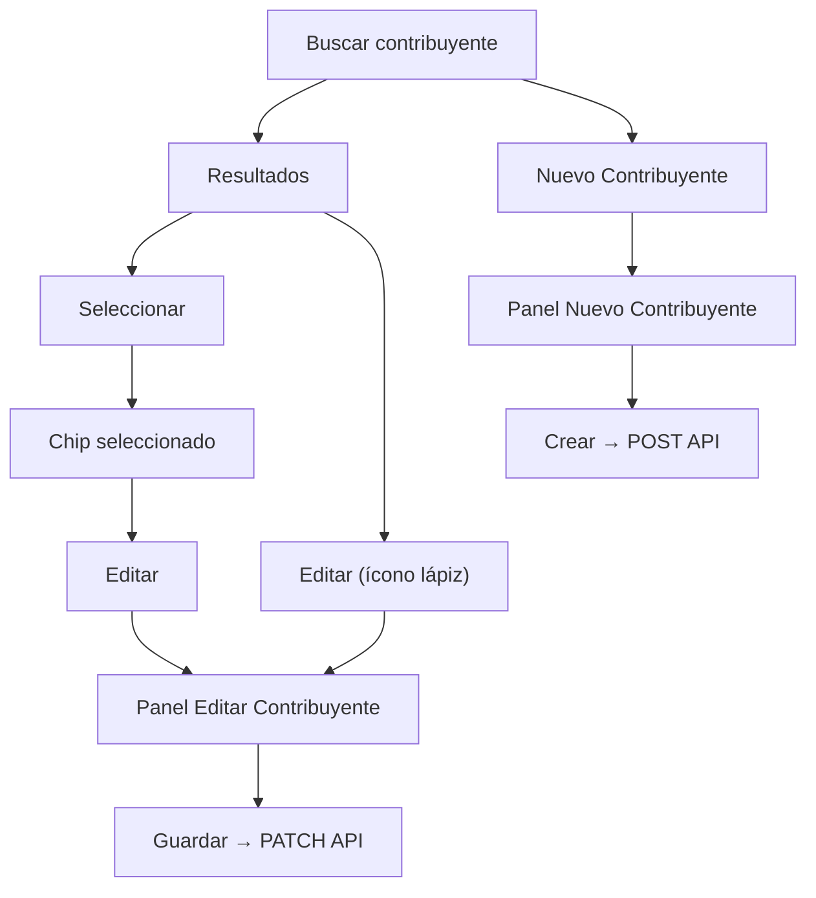
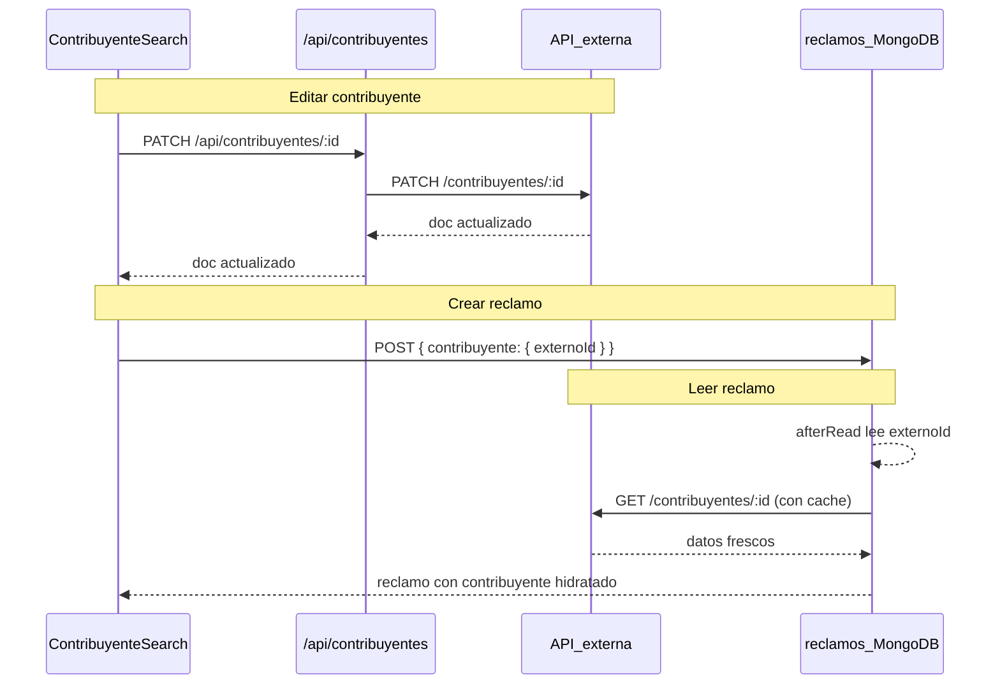

# Editar contribuyentes + fuente única de verdad

## Contexto actual

- Crear/buscar contribuyentes vive en [`ContribuyenteSearch.tsx`](<src/app/(frontend)/dashboard/reclamos/nuevo/ContribuyenteSearch.tsx>) (panel inline, mismos 6 campos de la captura).
- La API BFF solo expone `GET` y `POST` en [`route.ts`](src/app/api/contribuyentes/route.ts); no hay `PATCH`.
- Al crear un reclamo se guarda un **snapshot** completo vía `toContribuyenteSnapshot()` en [`NuevoReclamoForm.tsx`](<src/app/(frontend)/dashboard/reclamos/nuevo/NuevoReclamoForm.tsx>).
- El grupo `contribuyente` en [`Reclamos.ts`](src/collections/Reclamos.ts) tiene `externoId` + campos duplicados (`nombre`, `numero_documento`, etc.) indexados para búsqueda.

## Decisiones confirmadas

| Tema              | Decisión                                                                 |
| ----------------- | ------------------------------------------------------------------------ |
| Dónde editar      | Solo en el flujo de búsqueda/selección (`ContribuyenteSearch`)           |
| Datos en reclamos | Guardar solo `externoId`; hidratar el resto desde la API externa al leer |

## UX recomendada (mínima curva de aprendizaje)

Reutilizar el **mismo panel inline** que "Nuevo Contribuyente" — el encargado de carga ya conoce ese patrón.



**Detalles de UI:**

- En cada fila del dropdown: ícono lápiz (`IconPencil`) que abre el panel de edición **sin** seleccionar primero (útil para corregir datos mientras se busca).
- En el chip del contribuyente seleccionado: botón "Editar" junto al X de limpiar.
- Panel de edición = mismos campos que crear: Nombre*, Apellido*, DNI, Teléfono, Email, Dirección.
- Campo extra **solo lectura** en edición: `N° contribuyente` (ID legacy de Rentas) para contexto; no editable.
- Título del panel: "Editar Contribuyente" vs "Nuevo Contribuyente"; botón primario: "Guardar" (con checkmark).
- Tras guardar: si estaba seleccionado, actualizar el objeto en memoria con la respuesta del PATCH para que el reclamo nuevo use datos frescos.

**Parseo nombre ↔ apellido:** al editar, partir `nombre` del API en primera palabra = nombre, resto = apellido (inverso del join que ya hace el POST). No es perfecto para nombres compuestos, pero es consistente con el alta actual.

## Parte 1 — Backend: editar contribuyente

### 1. Cliente externo

En [`client.ts`](src/mi-sanbenito/client.ts):

- Agregar `UpdateContribuyenteInput` (mismos campos que `CreateContribuyenteInput`).
- Agregar `updateContribuyente(id, data)` → `PATCH ${EXTERNAL_API_BASE_URL}/contribuyentes/${id}`.
- **Verificación previa:** confirmar que la API de sanbenito.gob.ar acepta PATCH con esos campos (Payload REST estándar). Si falla, ajustar mapeo según respuesta real.

### 2. BFF route

Crear [`src/app/api/contribuyentes/[id]/route.ts`](src/app/api/contribuyentes/[id]/route.ts):

- `GET` — proxy a `getContribuyenteById` (auth: admin, carga, visualizador, ejecutor).
- `PATCH` — proxy a `updateContribuyente` con el mismo mapeo nombre/apellido/dni/telefono/email/direccion que el POST (auth: **admin** y **carga**).

Extraer el mapeo `LegacyCreateBody → campos externos` a un helper compartido en `route.ts` o `src/lib/contribuyente-map.ts` para no duplicar entre POST y PATCH.

## Parte 2 — Frontend: formulario compartido + edición

### 3. Extraer formulario reutilizable

Crear [`ContribuyenteFormPanel.tsx`](<src/app/(frontend)/dashboard/reclamos/nuevo/ContribuyenteFormPanel.tsx>) con:

- Props: `mode: 'create' | 'edit'`, `initialValues`, `numeroContribuyente?` (readonly en edit), `onSubmit`, `onCancel`, `loading`, `error`.
- Misma estructura visual y clases CSS que el panel actual (`.contrib-new-form`, `.modal-row`, etc.).

### 4. Actualizar ContribuyenteSearch

En [`ContribuyenteSearch.tsx`](<src/app/(frontend)/dashboard/reclamos/nuevo/ContribuyenteSearch.tsx>):

- Reemplazar el bloque inline del formulario de creación por `ContribuyenteFormPanel`.
- Estado `editingContribuyente: Contribuyente | null` para el panel de edición.
- `handleUpdate`: `PATCH /api/contribuyentes/${id}` con body legacy; al éxito, si `value?.id === id` llamar `onChange(updated.doc)`.
- Lápiz en dropdown + botón Editar en chip seleccionado.
- Solo mostrar acciones de edición si el usuario es `admin` o `carga` (recibir `canEdit` como prop desde `NuevoReclamoForm`, derivado del rol del usuario logueado).

## Parte 3 — Migrar de snapshot a solo ID

### 5. Schema de Reclamos

En [`Reclamos.ts`](src/collections/Reclamos.ts), simplificar el grupo `contribuyente` a **un solo campo**:

```typescript
{
  name: 'contribuyente',
  type: 'group',
  required: true,
  fields: [
    {
      name: 'externoId',
      type: 'text',
      required: true,
      index: true,
      admin: { readOnly: true },
    },
  ],
}
```

- Quitar índice `contribuyente.nombre` / `contribuyente.numero_documento`.
- Agregar índice en `contribuyente.externoId`.

### 6. Hidratación en lectura (afterRead)

Reemplazar `normalizeContribuyenteForRead` en [`contribuyente-snapshot.ts`](src/lib/contribuyente-snapshot.ts) por lógica de hidratación:

- Leer `externoId` del documento (o migrar desde campos legacy si aún existen en docs viejos).
- Fetch a `getContribuyenteById(externoId)` con **cache por request** (`req.context.contribuyenteCache = Map<string, Contribuyente>`) para evitar N+1 en listados.
- Devolver objeto enriquecido con forma `ContribuyenteRef` (externoId + campos del API) para que el frontend no cambie mucho.
- Fallback si API falla o contribuyente no existe: `{ externoId, nombre: 'Contribuyente no disponible' }`.

### 7. Escritura simplificada

En [`NuevoReclamoForm.tsx`](<src/app/(frontend)/dashboard/reclamos/nuevo/NuevoReclamoForm.tsx>):

```typescript
contribuyente: {
  externoId: contribuyente.id
}
```

Eliminar uso de `toContribuyenteSnapshot` en create (mantener helper solo si sirve para tests/migración).

### 8. Búsqueda en tabla de reclamos

Hoy [`ReclamosTable.tsx`](<src/app/(frontend)/dashboard/reclamos/ReclamosTable.tsx>) filtra por `contribuyente.nombre` y `contribuyente.numero_documento` en MongoDB — dejará de funcionar sin snapshot.

**Solución:** búsqueda en dos pasos en el `useEffect` de fetch:

1. Si hay `debouncedSearch`, llamar `GET /api/contribuyentes?...` (misma query que `ContribuyenteSearch`).
2. Armar el `where` de reclamos como OR de: `descripcion like X`, `numero equals X`, y `contribuyente.externoId in [ids encontrados]`.

**Ordenamiento:** quitar sort server-side por columna contribuyente (no se puede ordenar por campo hidratado). La columna sigue mostrando nombre desde datos hidratados; el sort por esa columna pasa a ser solo visual/cliente o se deshabilita.

### 9. Script de migración de datos

Actualizar o extender [`scripts/migrate-contribuyente-reclamos.mts`](scripts/migrate-contribuyente-reclamos.mts) para:

- En cada reclamo con grupo `contribuyente` completo, conservar solo `{ externoId }`.
- Para docs legacy con ObjectId, resolver `externoId` como ya hace el script actual.

### 10. Tipos y display

Archivos a tocar mínimamente (siguen leyendo `contribuyente.nombre`, etc. desde el objeto hidratado):

- [`mis-reclamos/types.ts`](<src/app/(frontend)/mis-reclamos/types.ts>) — `ContribuyenteRef` sigue igual (es la forma hidratada, no la persistida).
- [`reclamo-utils.ts`](src/lib/reclamo-utils.ts), `ReclamoDetailClient`, `MisReclamoCard`, `MisReclamoDetailDrawer`, `ReclamosTable` — sin cambios de display si afterRead hidrata bien.
- Correr `generate:types` + `tsc --noEmit`.

## Flujo resultante



## Riesgos y mitigaciones

| Riesgo                                       | Mitigación                                                                            |
| -------------------------------------------- | ------------------------------------------------------------------------------------- |
| API externa caída al listar reclamos         | Fallback con `externoId` + mensaje "no disponible"; cache por request reduce llamadas |
| PATCH no soportado en API externa            | Verificar en primer paso; si solo PUT, adaptar cliente                                |
| Búsqueda más lenta (2 requests)              | Debounce existente (350ms); limitar IDs de contribuyentes a 10-20                     |
| Nombres compuestos al partir nombre/apellido | Mismo trade-off que en alta; documentar limitación                                    |
| Reclamos viejos sin `externoId`              | Script de migración + fallback legacy en afterRead                                    |

## Validación manual

1. Login como `carga`.
2. Buscar contribuyente con datos incorrectos → Editar desde dropdown → Guardar → verificar en API.
3. Seleccionar contribuyente editado → crear reclamo → verificar que en MongoDB solo queda `{ externoId }`.
4. Abrir detalle y tabla de reclamos → datos del contribuyente reflejan la corrección (hidratados).
5. Buscar reclamo por nombre/DNI del contribuyente en la tabla → sigue funcionando vía búsqueda en dos pasos.
6. Login como `visualizador` → no ve botones de editar contribuyente.
7. `tsc --noEmit` sin errores.
