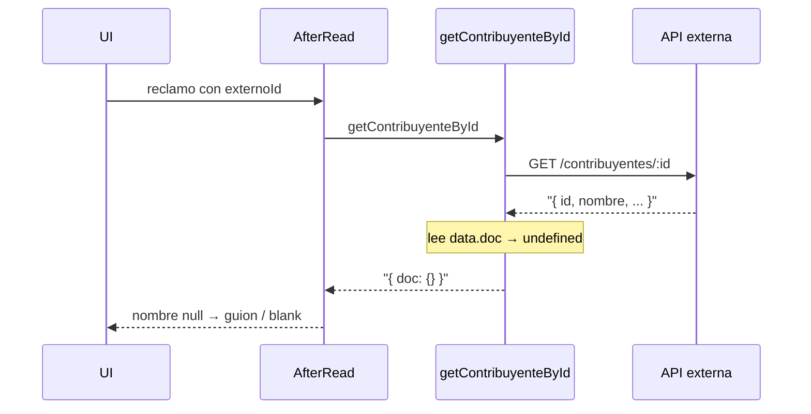

# Fix: contribuyente vacío en reclamos

## Causa raíz

Los reclamos guardan solo `{ externoId }` (grupo, no relationship). El nombre se hidrata en `afterRead` vía [`hydrateContribuyenteForRead`](src/lib/contribuyente-snapshot.ts) → [`getContribuyenteById`](src/mi-sanbenito/client.ts).

Payload REST:

- `find` → `{ docs: [...] }` (OK)
- `create`/`update` → `{ doc, message }` (OK)
- **`findByID` → documento en la raíz** (sin `doc`)

Hoy:

```127:138:src/mi-sanbenito/client.ts
export async function getContribuyenteById(id: string): Promise<ContribuyenteResponse> {
  // ...
  const data = await handleResponse<ContribuyenteResponse>(res)
  return { ...data, doc: stripSensitiveFields(data.doc) } // data.doc === undefined
}
```

`stripSensitiveFields(undefined)` → `{}` → snapshot con `nombre: null` → lista muestra **"—"**, detalle **"Contribuyente: "** vacío. No cae al fallback `"Contribuyente no disponible"` porque no hay throw.



## Cambio

**Archivo principal:** [`src/mi-sanbenito/client.ts`](src/mi-sanbenito/client.ts)

1. Normalizar la respuesta de `getContribuyenteById`: si el body ya tiene `doc`, usarlo; si no, tratar el body como el documento (caso findByID).
2. Devolver siempre `{ doc: Contribuyente }` para no romper a [`contribuyente-snapshot.ts`](src/lib/contribuyente-snapshot.ts) ni a [`/api/contribuyentes/[id]`](src/app/api/contribuyentes/[id]/route.ts).

Algo equivalente a:

```ts
const data = await handleResponse<Contribuyente | ContribuyenteResponse>(res)
const doc = 'doc' in data && data.doc ? data.doc : (data as Contribuyente)
return { doc: stripSensitiveFields(doc) }
```

**Defensa extra en** [`src/lib/contribuyente-snapshot.ts`](src/lib/contribuyente-snapshot.ts): en `fetchContribuyenteSnapshot`, si `doc` viene vacío / sin `id`, usar `unavailableSnapshot(externoId)` en lugar de hidratar con `nombre: null`. Así un fallo similar no vuelve a dejar la UI en blanco.

## Verificación

- Recargar `/dashboard/reclamos` → columna Contribuyente con nombre (no "—").
- Abrir `/dashboard/reclamos/[id]` → "Contribuyente: {nombre}" (y DNI si aplica).
- No hace falta cambiar schema ni UI: ya esperan `contribuyente.nombre` del snapshot hidratado.
