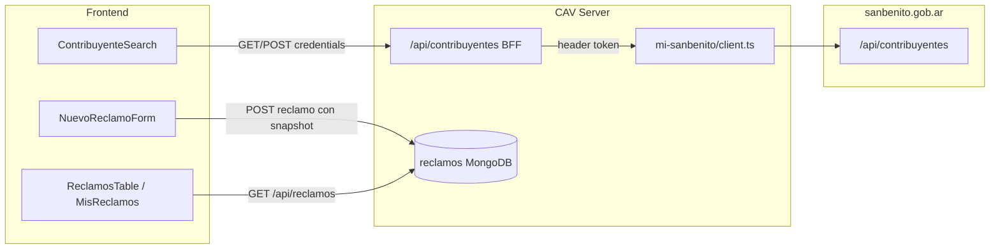

# Migración de contribuyentes a API externa

## Contexto actual

Hoy el sistema tiene una collection local [`src/collections/Contribuyentes.ts`](src/collections/Contribuyentes.ts) con campos `nombre`, `apellido`, `dni`, `telefono`, `email`, `direccion`. Los reclamos la referencian como relationship en [`src/collections/Reclamos.ts`](src/collections/Reclamos.ts).

El frontend consume contribuyentes en un solo punto de escritura/lectura directa:

- [`ContribuyenteSearch.tsx`](<src/app/(frontend)/dashboard/reclamos/nuevo/ContribuyenteSearch.tsx>) — `GET /api/contribuyentes` (búsqueda) y `POST /api/contribuyentes` (alta)

El resto del uso es **lectura desnormalizada** vía `depth` al cargar reclamos:

| Archivo                                                                                                                                                                     | Uso                                                           |
| --------------------------------------------------------------------------------------------------------------------------------------------------------------------------- | ------------------------------------------------------------- |
| [`NuevoReclamoForm.tsx`](<src/app/(frontend)/dashboard/reclamos/nuevo/NuevoReclamoForm.tsx>)                                                                                | Guarda `contribuyente.id` al crear reclamo                    |
| [`ReclamosTable.tsx`](<src/app/(frontend)/dashboard/reclamos/ReclamosTable.tsx>)                                                                                            | Búsqueda/orden/export por `contribuyente.nombre/apellido/dni` |
| [`ReclamoDetailClient.tsx`](<src/app/(frontend)/dashboard/reclamos/[id]/ReclamoDetailClient.tsx>)                                                                           | Muestra nombre, apellido, DNI                                 |
| [`MisReclamoCard.tsx`](<src/app/(frontend)/mis-reclamos/MisReclamoCard.tsx>) / [`MisReclamoDetailDrawer.tsx`](<src/app/(frontend)/mis-reclamos/MisReclamoDetailDrawer.tsx>) | Muestra contribuyente en cards del ejecutor                   |
| [`reclamo-utils.ts`](src/lib/reclamo-utils.ts)                                                                                                                              | `getContribuyenteNombre()` concatena nombre + apellido        |

La API externa (tipos en [`src/mi-sanbenito/types.ts`](src/mi-sanbenito/types.ts)) tiene un esquema distinto: un solo `nombre`, `numero_documento`, `telefono_web`, `domicilio`, `numero_contribuyente`, etc.

## Arquitectura propuesta



**Principio clave:** `EXTERNAL_API_KEY` nunca sale del servidor. El browser sigue llamando a `/api/contribuyentes` (misma URL que hoy), pero la ruta custom del BFF reemplaza la REST automática de Payload al eliminar la collection local.

## 1. Cliente de API externa

Crear [`src/mi-sanbenito/client.ts`](src/mi-sanbenito/client.ts):

- Base URL: `https://sanbenito.gob.ar/api` (agregar `EXTERNAL_API_BASE_URL` en [`src/config.ts`](src/config.ts) con ese default)
- Header obligatorio en **toda** request: `{ token: EXTERNAL_API_KEY }`
- Funciones: `findContribuyentes(searchParams)`, `getContribuyenteById(id)`, `createContribuyente(data)`
- Tipos importados desde [`src/mi-sanbenito/types.ts`](src/mi-sanbenito/types.ts)
- Respuesta Payload estándar: `{ docs, totalDocs, ... }` / `{ doc }`

## 2. BFF `/api/contribuyentes`

Crear [`src/app/api/contribuyentes/route.ts`](src/app/api/contribuyentes/route.ts):

- **Auth:** `payload.auth({ headers })` — rechazar 401 si no hay usuario (mismo patrón que [`src/app/api/reclamos/nearby/route.ts`](src/app/api/reclamos/nearby/route.ts))
- **GET:** reenviar query string tal cual a la API externa (Payload REST compatible). El BFF agrega el `token`
- **POST:** proxy a la API externa. Mapear el body del formulario actual al esquema externo:
  - `nombre` ← `` `${nombre} ${apellido}`.trim() ``
  - `numero_documento` ← `dni`
  - `telefono_web` ← `telefono`
  - `domicilio` ← `direccion`
  - `email` ← `email`
- Opcional: [`src/app/api/contribuyentes/[id]/route.ts`](src/app/api/contribuyentes/[id]/route.ts) para GET por ID (útil si en el futuro se necesita refrescar datos)

Restricción de roles sugerida para POST: `admin` o `carga` (quienes crean reclamos). GET: cualquier usuario autenticado.

## 3. Cambio de schema en Reclamos

En [`src/collections/Reclamos.ts`](src/collections/Reclamos.ts), reemplazar el relationship:

```typescript
// Antes
{ name: 'contribuyente', type: 'relationship', relationTo: 'contribuyentes', required: true }

// Después — snapshot embebido del contribuyente externo
{
  name: 'contribuyente',
  type: 'group',
  required: true,
  fields: [
    { name: 'id', type: 'text', required: true },
    { name: 'numero_contribuyente', type: 'number' },
    { name: 'nombre', type: 'text' },
    { name: 'numero_documento', type: 'text' },
    { name: 'telefono_web', type: 'text' },
    { name: 'email', type: 'text' },
    { name: 'domicilio', type: 'text' },
  ],
}
```

**Por qué snapshot y no solo ID externo:**

- La búsqueda en `ReclamosTable` usa `where[contribuyente.*]` — funciona con campos embebidos sin joins
- `depth=2` ya no necesita popular una relationship; los datos viajan en el documento
- No hay dependencia de la API externa en cada lectura de reclamos

Actualizar el índice `{ fields: ['contribuyente'] }` a campos buscables, ej. `{ fields: ['contribuyente.nombre', 'contribuyente.numero_documento'] }`.

## 4. Eliminar collection local

- Quitar `Contribuyentes` de [`src/payload.config.ts`](src/payload.config.ts)
- Eliminar [`src/collections/Contribuyentes.ts`](src/collections/Contribuyentes.ts)
- Ejecutar `generate:types` para actualizar [`src/payload-types.ts`](src/payload-types.ts)

No se requiere script de migración (confirmado: datos frescos).

## 5. Actualizar frontend

### ContribuyenteSearch

[`ContribuyenteSearch.tsx`](<src/app/(frontend)/dashboard/reclamos/nuevo/ContribuyenteSearch.tsx>):

- Usar tipo `Contribuyente` de `@/mi-sanbenito/types`
- Búsqueda: cambiar query a campos externos:
  ```
  where[or][0][nombre][contains]=...
  where[or][1][numero_documento][contains]=...
  where[or][2][numero_contribuyente][equals]=... (si el query es numérico)
  ```
- Display: `nombre` (campo único), `numero_documento`, `telefono_web`
- Avatar/iniciales: primeras letras de `nombre`
- Mantener formulario "Nuevo Contribuyente" con nombre/apellido separados; el BFF hace el mapeo al POST externo
- Tras crear, usar `data.doc` de la respuesta externa

### NuevoReclamoForm

[`NuevoReclamoForm.tsx`](<src/app/(frontend)/dashboard/reclamos/nuevo/NuevoReclamoForm.tsx>):

- Al crear reclamo, enviar el **objeto grupo completo** (snapshot), no solo el `id`:
  ```typescript
  contribuyente: {
    id: c.id,
    numero_contribuyente: c.numero_contribuyente,
    nombre: c.nombre,
    numero_documento: c.numero_documento,
    telefono_web: c.telefono_web,
    email: c.email,
    domicilio: c.domicilio,
  }
  ```

### Utilidades y tipos compartidos

- [`src/lib/reclamo-utils.ts`](src/lib/reclamo-utils.ts): `getContribuyenteNombre` → devolver `contribuyente.nombre` (sin apellido)
- [`src/app/(frontend)/mis-reclamos/types.ts`](<src/app/(frontend)/mis-reclamos/types.ts>): actualizar `ContribuyenteRef` al nuevo esquema

### Componentes de visualización

Actualizar referencias de campos viejos → nuevos en:

- [`ReclamoDetailClient.tsx`](<src/app/(frontend)/dashboard/reclamos/[id]/ReclamoDetailClient.tsx>): `dni` → `numero_documento`
- [`MisReclamoCard.tsx`](<src/app/(frontend)/mis-reclamos/MisReclamoCard.tsx>) / [`MisReclamoDetailDrawer.tsx`](<src/app/(frontend)/mis-reclamos/MisReclamoDetailDrawer.tsx>): `dni` → `numero_documento`, `telefono` → `telefono_web`
- [`ReclamosTable.tsx`](<src/app/(frontend)/dashboard/reclamos/ReclamosTable.tsx>):
  - Búsqueda: `contribuyente.nombre`, `contribuyente.numero_documento` (eliminar `apellido`, `dni`)
  - Sort: `contribuyente.nombre` en lugar de `contribuyente.apellido`
  - Columnas y CSV export con campos nuevos
- [`MisReclamosClient.tsx`](<src/app/(frontend)/mis-reclamos/MisReclamosClient.tsx>): la búsqueda local por `getContribuyenteNombre` seguirá funcionando tras actualizar el helper

### Depth en fetches

Con datos embebidos, `depth=2` en mis-reclamos y detalle de reclamo deja de ser necesario para contribuyente, pero no rompe nada. Se puede bajar a `depth=1` como optimización menor.

## 6. Validación

- `tsc --noEmit` tras los cambios
- Probar manualmente:
  1. Login como usuario `carga`
  2. Buscar contribuyente en nuevo reclamo (verificar token en logs del BFF si hace falta debug)
  3. Crear contribuyente nuevo vía formulario inline
  4. Crear reclamo y verificar snapshot guardado
  5. Ver reclamo en tabla, detalle y mis-reclamos (ejecutor) con datos correctos
  6. Export CSV con columnas de contribuyente

## Riesgos y mitigaciones

| Riesgo                                              | Mitigación                                                                                               |
| --------------------------------------------------- | -------------------------------------------------------------------------------------------------------- |
| API externa rechaza POST con campos mínimos         | El BFF devuelve el error de Payload tal cual; ajustar mapeo según respuesta real                         |
| `EXTERNAL_API_KEY` vacía en deploy                  | Validar al iniciar el cliente y loguear error claro                                                      |
| Ruta BFF vs catch-all de Payload                    | La ruta específica `src/app/api/contribuyentes/route.ts` tiene prioridad sobre `(payload)/api/[...slug]` |
| Campos sensibles (`clave_web`) en respuesta externa | El BFF puede hacer `select` en el proxy GET para no exponer campos innecesarios al frontend              |

## Archivos principales a crear/modificar

**Crear:**

- `src/mi-sanbenito/client.ts`
- `src/app/api/contribuyentes/route.ts`

**Modificar:**

- `src/config.ts`
- `src/collections/Reclamos.ts`
- `src/payload.config.ts`
- `src/app/(frontend)/dashboard/reclamos/nuevo/ContribuyenteSearch.tsx`
- `src/app/(frontend)/dashboard/reclamos/nuevo/NuevoReclamoForm.tsx`
- `src/lib/reclamo-utils.ts`
- `src/app/(frontend)/mis-reclamos/types.ts`
- `src/app/(frontend)/dashboard/reclamos/ReclamosTable.tsx`
- `src/app/(frontend)/dashboard/reclamos/[id]/ReclamoDetailClient.tsx`
- `src/app/(frontend)/mis-reclamos/MisReclamoCard.tsx`
- `src/app/(frontend)/mis-reclamos/MisReclamoDetailDrawer.tsx`

**Eliminar:**

- `src/collections/Contribuyentes.ts`
