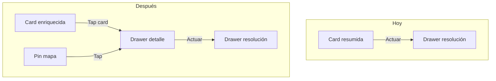

# Mis reclamos ejecutor: info en cards, drawer de detalle y mapa

## Estado actual

[`MisReclamosClient.tsx`](<src/app/(frontend)/mis-reclamos/MisReclamosClient.tsx>) muestra poco contexto por tarea:

- Card: `#numero`, estado, `tipo` (valor crudo), calle, descripción truncada, botón "Actuar".
- El drawer existente es **solo el formulario de resolución** (no hay vista de detalle previa).
- El fetch no popula relaciones (`depth` ausente): contribuyente, concepto, fotos y movimientos llegan como IDs.
- No hay mapa en la vista ejecutor (sí existe referencia en [`MapaReclamosClient.tsx`](<src/app/(frontend)/dashboard/mapa/MapaReclamosClient.tsx>) con Leaflet).



## Campos a mostrar (sin ID de MongoDB)

Usar siempre `#numero` como identificador humano. Nunca renderizar `reclamo.id`.

| Zona                  | Campos                                                                                                                                                                                                                                                                                                                                                                                                              |
| --------------------- | ------------------------------------------------------------------------------------------------------------------------------------------------------------------------------------------------------------------------------------------------------------------------------------------------------------------------------------------------------------------------------------------------------------------- |
| **Card colapsada**    | `#numero`, tipo (con `tipoLabel`), estado, prioridad, SLA (`getSlaStatus` + badges de [`constants.ts`](src/lib/constants.ts)), calle + barrio, concepto (si existe), fecha de alta relativa                                                                                                                                                                                                                         |
| **Drawer de detalle** | Todo lo anterior + descripción completa, contribuyente (nombre, teléfono con `tel:` link, DNI), medio de ingreso, área derivada, ubicación (calle, barrio, localidad, botón "Abrir en Maps"), fecha compromiso, observaciones internas, fotos (thumbnails vía [`getMediaUrl`](src/lib/media.ts)), historial de movimientos (estado, fecha, nota, adjuntos, usuario), botón **Actuar** si no está en estado terminal |

Agregar `medioLabel` en [`src/lib/constants.ts`](src/lib/constants.ts) (presencial, whatsapp, correo, calle, otro).

## Cambios de datos (API)

Actualizar el fetch en `MisReclamosClient`:

```typescript
;`/api/reclamos?where[area_derivada][in]=${areaIds}&sort=createdAt&limit=0&depth=2`
```

Ampliar la interfaz local `Reclamo` con los campos poblados: `contribuyente`, `concepto`, `area_derivada`, `ubicacion`, `medio`, `fechaCompromiso`, `observaciones`, `movimientos`, `fotos`.

Helper de coordenadas (reutilizable en mapa y link a Maps):

```typescript
function getReclamoCoords(r: Reclamo): { lat: number; lng: number } | null {
  if (r.coordenadas?.lat != null && r.coordenadas?.lng != null)
    return { lat: r.coordenadas.lat, lng: r.coordenadas.lng }
  const loc = r.ubicacion?.location
  if (loc?.length === 2) return { lat: loc[1], lng: loc[0] }
  return null
}
```

## Arquitectura de componentes

Extraer de `MisReclamosClient.tsx` para mantener el archivo manejable:

1. **`MisReclamoCard.tsx`** — card resumida; tap en el cuerpo abre detalle; botón "Actuar" con `stopPropagation`.
2. **`MisReclamoDetailDrawer.tsx`** — drawer inferior de solo lectura + CTA "Actuar" (reutilizado por lista y mapa).
3. **`MisReclamosMap.tsx`** — mapa Leaflet (`dynamic(..., { ssr: false })`), markers coloreados por estado (patrón de `MapaReclamosClient`), **sin popup HTML de Leaflet**; `onMarkerClick(reclamo)` abre el mismo `MisReclamoDetailDrawer`.
4. **`MisReclamosClient.tsx`** — orquestación: fetch, filtros, `viewMode`, estado `detailReclamo` / `actionReclamo`.

El drawer de resolución existente se mantiene; desde el drawer de detalle, "Actuar" cierra detalle y abre resolución con el mismo reclamo.

## Layout responsive (decisión confirmada)

**Mobile (< `lg`):** toggle **Lista | Mapa** en la toolbar (junto a búsqueda y cercanía). Una vista a la vez; el mapa ocupa el área scrollable restante (`flex: 1; min-height: 0`).

**Desktop (`lg+`):** split — lista a la izquierda (~40%), mapa a la derecha (~60%), ambos visibles. Los filtros de búsqueda y cercanía aplican a ambos paneles.

```
Mobile                         Desktop (lg+)
┌─────────────────┐           ┌──────────┬─────────────┐
│ Header + tabs   │           │ Header   │             │
├─────────────────┤           ├──────────┼─────────────┤
│ Lista  OR  Mapa │           │  Lista   │    Mapa     │
└─────────────────┘           └──────────┴─────────────┘
```

CSS nuevo en [`styles.css`](<src/app/(frontend)/styles.css>):

- `.mis-reclamos-view-tabs` — segmented control Lista/Mapa (solo visible en mobile).
- `.mis-reclamos-split` — grid `1fr` en mobile, `2fr 3fr` en `lg+`.
- `.mis-reclamos-map-panel` — altura mínima ~280px mobile, `100%` en split desktop.
- `.mis-reclamo-card-meta`, `.mis-reclamo-detail-*` — filas de metadatos, timeline de movimientos, grid de fotos.
- Reutilizar clases del drawer existente (`.mis-reclamos-drawer-*`) para consistencia visual y dark mode.

## Mapa

- Centro inicial: San Benito (`-31.7795, -60.4414`), zoom 14 (igual que dashboard).
- Markers: `circleMarker` con colores por estado (`ESTADO_COLORS` de `MapaReclamosClient`).
- Solo reclamos con coords (`getReclamoCoords`); leyenda compacta bajo el mapa.
- Al hacer click en marker: `setDetailReclamo(reclamo)` — mismo drawer que al tocar la card.
- Opcional: centrar mapa en marker seleccionado (`map.panTo`).

Importar Leaflet con `dynamic` en un wrapper para evitar SSR issues (mismo patrón que [`dashboard/mapa/page.tsx`](<src/app/(frontend)/dashboard/mapa/page.tsx>)).

## Flujo de interacción

1. Usuario ve lista enriquecida (o mapa en desktop split).
2. Tap en card o pin → **drawer de detalle** (info completa).
3. Tap "Actuar" en drawer → cierra detalle → abre **drawer de resolución** (formulario actual sin cambios funcionales).
4. Tap "Actuar" directo en card (atajo) → salta al drawer de resolución (comportamiento actual preservado).

## Archivos principales a tocar

| Archivo                                                                            | Acción                                                           |
| ---------------------------------------------------------------------------------- | ---------------------------------------------------------------- |
| [`MisReclamosClient.tsx`](<src/app/(frontend)/mis-reclamos/MisReclamosClient.tsx>) | Refactor: fetch depth=2, viewMode, split layout, wiring drawers  |
| `mis-reclamos/MisReclamoCard.tsx`                                                  | **Nuevo**                                                        |
| `mis-reclamos/MisReclamoDetailDrawer.tsx`                                          | **Nuevo**                                                        |
| `mis-reclamos/MisReclamosMap.tsx`                                                  | **Nuevo**                                                        |
| [`constants.ts`](src/lib/constants.ts)                                             | Agregar `medioLabel`                                             |
| [`styles.css`](<src/app/(frontend)/styles.css>)                                    | Estilos cards enriquecidas, split, mapa ejecutor, drawer detalle |

## Validación

- `tsc --noEmit` tras los cambios.
- Probar en mobile (tabs Lista/Mapa) y desktop (split).
- Verificar dark/light en cards, drawer detalle y mapa.
- Confirmar que ningún lugar muestra `reclamo.id`.
- Pin sin coords: no aparece en mapa; card sigue visible en lista.
