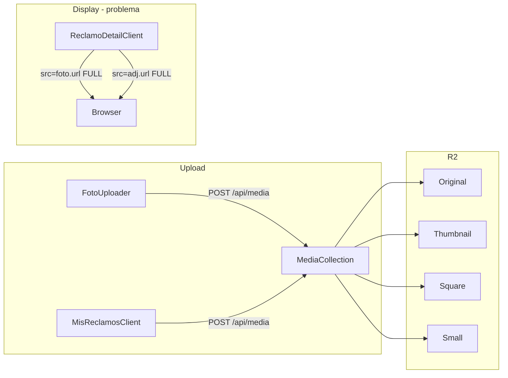

# Optimizar uso de thumbnails en colección media

## Contexto

La colección de imágenes se llama **`media`** (slug `media`), no `imagenes`. Tu nota en [`.anotaciones.md`](.anotaciones.md) se refiere a esta colección.

Configuración actual en [`src/collections/Media.ts`](src/collections/Media.ts):

| Tamaño           | Dimensiones                         | Uso ideal                          |
| ---------------- | ----------------------------------- | ---------------------------------- |
| `thumbnail`      | 300px ancho                         | Previews pequeños (64–120px en UI) |
| `square`         | 500×500                             | Avatares / crops cuadrados         |
| `small`          | 600px ancho                         | Vistas medianas                    |
| `url` (original) | Hasta 1920px (comprimido en upload) | Ver imagen completa                |

El plugin R2 en [`src/plugins/storage.ts`](src/plugins/storage.ts) ya genera y almacena todos los tamaños en el bucket bajo el prefijo `media/`. Payload expone las URLs en `sizes.thumbnail.url`, `thumbnailURL`, y `url`.

## Estado actual



**Único punto de renderizado hoy:** [`src/app/(frontend)/dashboard/reclamos/[id]/ReclamoDetailClient.tsx`](<src/app/(frontend)/dashboard/reclamos/[id]/ReclamoDetailClient.tsx>)

| Sección                 | Tamaño CSS | URL actual | Debería usar                                |
| ----------------------- | ---------- | ---------- | ------------------------------------------- |
| Fotos adjuntas          | 120×120    | `foto.url` | `thumbnail` en ``, `url` en `<a href>` |
| Adjuntos de movimientos | 64×64      | `adj.url`  | `thumbnail` en ``, `url` en `<a href>` |

Otros archivos que tocan `media` solo **suben** o guardan IDs — no renderizan:

- [`src/components/FotoUploader.tsx`](src/components/FotoUploader.tsx) — preview con blob local (correcto)
- [`src/app/(frontend)/dashboard/reclamos/nuevo/NuevoReclamoForm.tsx`](<src/app/(frontend)/dashboard/reclamos/nuevo/NuevoReclamoForm.tsx>)
- [`src/app/(frontend)/mis-reclamos/MisReclamosClient.tsx`](<src/app/(frontend)/mis-reclamos/MisReclamosClient.tsx>) — sube fotos pero no las muestra aún

El fetch ya usa `depth=2`, por lo que `fotos` y `movimientos.adjuntos` llegan como objetos `Media` completos con `sizes` — no hace falta cambiar las queries.

## Cambios propuestos

### 1. Crear helper `getMediaUrl`

Nuevo archivo [`src/lib/media.ts`](src/lib/media.ts):

```typescript
import type { Media } from '@/payload-types'

export type MediaSize = 'thumbnail' | 'square' | 'small' | 'full'

export function getMediaUrl(
  media: string | Media | null | undefined,
  size: MediaSize = 'thumbnail',
): string | null {
  if (!media || typeof media === 'string') return null

  if (size === 'full') return media.url ?? null

  const sized = media.sizes?.[size]?.url
  if (sized) return sized

  if (size === 'thumbnail' && media.thumbnailURL) return media.thumbnailURL

  return media.url ?? null // fallback para media legacy sin sizes
}
```

Cadena de fallback: `sizes[size].url` → `thumbnailURL` (solo para thumbnail) → `url` original. Esto cubre imágenes subidas antes de que existieran los tamaños definidos.

### 2. Actualizar `ReclamoDetailClient`

En las dos galerías de imágenes:

- **``** → `getMediaUrl(foto, 'thumbnail')`
- **`<a href>`** → `getMediaUrl(foto, 'full')` (para abrir la imagen completa en nueva pestaña)

Mismo patrón para `adj` en movimientos. Agregar `loading="lazy"` en los `` (mejora menor, sin costo).

Ejemplo del cambio:

```tsx
// Antes

<a href={foto.url} ...>

// Después
const thumb = getMediaUrl(foto, 'thumbnail')
const full = getMediaUrl(foto, 'full')
{thumb && full && (
  <a href={full} ...>
    
  </a>
)}
```

### 3. Sin cambios necesarios en

- **Colección Media** — los tamaños ya están bien definidos para el uso actual
- **Plugin R2** — ya genera y sirve los resized files
- **FotoUploader / upload flow** — la compresión client-side (max 1920px) es independiente de la optimización de display
- **Queries API** — `depth=2` ya popula los objetos completos

## Impacto esperado

Para una foto típica de 2–4 MB subida desde celular:

- Galería 120×120: de ~2–4 MB a ~15–40 KB por imagen (thumbnail 300px)
- Adjuntos 64×64: mismo ahorro proporcional
- En un reclamo con 5 fotos + 3 adjuntos: reducción de ~10–30 MB a ~150–300 KB de transferencia en la vista de detalle

## Consideración: media legacy

Si hay archivos subidos **antes** de configurar `imageSizes`, no tendrán `sizes.thumbnail`. El fallback a `url` evita imágenes rotas. Si en producción existen muchos registros legacy, se podría correr un script de re-procesamiento con Payload (fuera del scope de este cambio).

## Futuro (no incluido en este PR)

Cuando [`MisReclamosClient.tsx`](<src/app/(frontend)/mis-reclamos/MisReclamosClient.tsx>) muestre fotos en cards o drawer (mencionado en tus anotaciones para ejecutores), usar el mismo `getMediaUrl(media, 'thumbnail')` desde el inicio y asegurar `depth=1` o `depth=2` en el fetch de reclamos.
