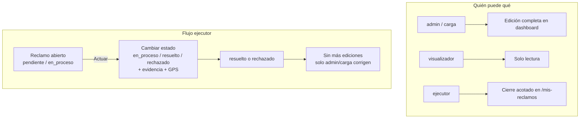

# Reclamos: permisos, CSV unificado y eliminación de Reportes

## Contexto actual

- **Edición en dashboard:** hoy cualquier rol excepto `visualizador` ve el formulario de movimientos en [`ReclamoDetailClient.tsx`](<src/app/(frontend)/dashboard/reclamos/[id]/ReclamoDetailClient.tsx>).
- **Backend:** en [`Reclamos.ts`](src/collections/Reclamos.ts), `update` permite `admin`, `carga` y `ejecutor` (este último solo en su área), sin restricción de campos ni de estados terminales.
- **Ejecutor móvil:** [`MisReclamosClient.tsx`](<src/app/(frontend)/mis-reclamos/MisReclamosClient.tsx>) permite `resuelto` o `en_proceso` (falta `rechazado`); el GPS se guarda solo como texto en la nota, no en `coordenadas`/`ubicacion`.
- **Reportes:** vista separada que exporta vía `xlsx` — se elimina.
- **CSV en Reclamos:** ya existe pero duplica filtros, usa `limit=10000` y no aplica el orden de la tabla.



---

## 1. Permisos de edición

### Modelo de roles (definitivo)

| Rol              | Crear | Editar en dashboard | Cerrar en /mis-reclamos                            |
| ---------------- | ----- | ------------------- | -------------------------------------------------- |
| **admin**        | Sí    | Edición completa    | N/A (redirigido al dashboard)                      |
| **carga**        | Sí    | Edición completa    | N/A                                                |
| **visualizador** | No    | No                  | No                                                 |
| **ejecutor**     | Sí    | No                  | Sí, solo campos acotados y solo si no está cerrado |

**Estados terminales ("cerrado"):** `resuelto` o `rechazado`. Una vez en cualquiera de esos, el ejecutor no puede volver a modificar el reclamo.

### Backend — [`src/collections/Reclamos.ts`](src/collections/Reclamos.ts)

**`access.update`** — mantener tres niveles:

```typescript
update: ({ req: { user } }) => {
  if (!user) return false
  if (user.role === 'admin' || user.role === 'carga') return true
  if (user.role === 'ejecutor' && user.areas?.length) {
    const areaIds = user.areas.map((a) => (typeof a === 'string' ? a : a.id))
    return { area_derivada: { in: areaIds } }
  }
  return false
},
```

**`beforeChange` hook (nuevo bloque para ejecutor en `update`):**

1. Si `req.user.role === 'ejecutor'` y `originalDoc.estado` es `resuelto` o `rechazado` → lanzar `APIError` 403 ("Reclamo cerrado; contacte a administración").
2. Whitelist de campos que el ejecutor puede enviar:
   - `estado` — solo valores `en_proceso`, `resuelto`, `rechazado`
   - `_nuevoMovimiento` — obligatorio al cambiar estado (nota + adjuntos del movimiento)
   - `fotos` — append de evidencia
   - `coordenadas` — `{ lat, lng }`
   - `ubicacion.location` — `[lng, lat]` (formato point de Payload)
3. Ignorar/rechazar cualquier otro campo del payload del ejecutor (descripción, área, contribuyente, tipo, etc.).
4. No permitir al ejecutor transicionar **desde** un estado terminal (ya cubierto por el punto 1).

> La seguridad vive en el hook del servidor; el frontend solo refleja las mismas reglas.

### Frontend dashboard

| Archivo                                                                                           | Cambio                                                                 |
| ------------------------------------------------------------------------------------------------- | ---------------------------------------------------------------------- |
| [`ReclamoDetailClient.tsx`](<src/app/(frontend)/dashboard/reclamos/[id]/ReclamoDetailClient.tsx>) | Formulario de edición solo si `role === 'admin' \|\| role === 'carga'` |
| [`ReclamosTable.tsx`](<src/app/(frontend)/dashboard/reclamos/ReclamosTable.tsx>)                  | Botón "Nuevo Reclamo" solo para `admin` y `carga`                      |
| [`DashboardHome.tsx`](<src/app/(frontend)/dashboard/DashboardHome.tsx>)                           | Misma condición                                                        |
| [`NuevoReclamoForm.tsx`](<src/app/(frontend)/dashboard/reclamos/nuevo/NuevoReclamoForm.tsx>)      | Permitir `admin`, `carga`, `ejecutor`; redirigir al resto              |

### Frontend ejecutor — [`MisReclamosClient.tsx`](<src/app/(frontend)/mis-reclamos/MisReclamosClient.tsx>)

**Mantener** el drawer de resolución, con estos ajustes:

1. **Opciones de estado:** agregar `rechazado` junto a `resuelto` y `en_proceso` (mantener "Programado / No resuelto aún").
2. **Ocultar botón "Actuar"** si `reclamo.estado` es `resuelto` o `rechazado`.
3. **Geolocalización real:** al enviar, persistir GPS en:
   - `coordenadas: { lat, lng }`
   - `ubicacion.location: [lng, lat]`
   - Mantener referencia en la nota del movimiento como respaldo legible.
4. **Evidencia:** seguir subiendo foto a `/api/media` y adjuntar en `fotos` del reclamo y en `_nuevoMovimiento.adjuntos`.
5. **Manejo de error 403:** si el backend rechaza (reclamo ya cerrado), mostrar mensaje claro y refrescar lista.

---

## 2. Eliminar vista Reportes y dependencia xlsx

### Archivos a eliminar

- [`src/app/(frontend)/dashboard/reportes/page.tsx`](<src/app/(frontend)/dashboard/reportes/page.tsx>)
- [`src/app/(frontend)/dashboard/reportes/ReportesClient.tsx`](<src/app/(frontend)/dashboard/reportes/ReportesClient.tsx>)
- [`src/app/(frontend)/api/reportes/route.ts`](<src/app/(frontend)/api/reportes/route.ts>)

### Navegación — [`DashboardShell.tsx`](<src/app/(frontend)/dashboard/DashboardShell.tsx>)

- Quitar el ítem `Reportes` de `navItems`.
- Eliminar import de `IconFileExport` si queda sin uso.

### Dependencia

- Ejecutar `bun remove xlsx` para quitar de [`package.json`](package.json) y [`bun.lock`](bun.lock).

---

## 3. Mejorar exportación CSV en Reclamos

Todo en [`ReclamosTable.tsx`](<src/app/(frontend)/dashboard/reclamos/ReclamosTable.tsx>).

### Refactor de query params

Extraer `buildReclamosQueryParams(...)` reutilizada por:

1. El `fetch` paginado (con `page` + `limit=pageSize`).
2. El export (con `limit=0`, sin `page`, **con el mismo `sort`** que la tabla).

Filtros a centralizar: estado, tipo, área, SLA, búsqueda global (`debouncedSearch`).

### Export sin paginación

- Usar `limit=0` (mismo patrón que [`MisReclamosClient.tsx`](<src/app/(frontend)/mis-reclamos/MisReclamosClient.tsx>)).
- Si `json.totalDocs > json.docs.length`, alerta de truncado (fallback defensivo).
- Aplicar el orden actual de la tabla al CSV.

### Calidad del CSV

- Helper `escapeCsvCell()` para comas, comillas y saltos de línea.
- Sumar **Dirección** y **Barrio** desde `ubicacion` (campos que tenía Reportes).

### UX

- Tooltip: "Exportar CSV (todos los resultados filtrados)".

---

## 4. Validación

1. `bun run tsc --noEmit`
2. **admin / carga:** crear, editar cualquier campo, reabrir un reclamo cerrado si hace falta.
3. **visualizador:** solo lectura en dashboard.
4. **ejecutor:**
   - Puede actuar sobre reclamos `pendiente` / `en_proceso` de su área.
   - Puede pasar a `en_proceso`, `resuelto` o `rechazado` con foto y GPS.
   - No ve botón "Actuar" en reclamos `resuelto` / `rechazado`.
   - PATCH sobre reclamo cerrado devuelve 403.
5. CSV: filtros + búsqueda multi-página → tabla paginada, CSV con todos los `totalDocs`.
6. Sin `/dashboard/reportes` ni imports de `xlsx`.
