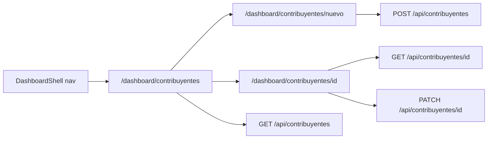

# Sección Contribuyentes en el dashboard

## Alcance confirmado

- **Roles:** `admin`/`carga` ven listado + crear + editar; `visualizador` solo listado (sin CTA de crear/editar); `ejecutor` no ve la sección (sigue fuera del dashboard).
- **UX de alta/edición:** páginas dedicadas, lo más parecido posible a [NuevoReclamoForm](<src/app/(frontend)/dashboard/reclamos/nuevo/NuevoReclamoForm.tsx>) (header con volver, título, formulario a pantalla completa, submit).
- **Columnas:** N° contribuyente, Nombre, DNI, Domicilio, Teléfono, Email.
- **Sin** export CSV / reportes.
- **No modificar** el create/edit rápido dentro de reclamos ([ContribuyenteSearch](<src/app/(frontend)/dashboard/reclamos/nuevo/ContribuyenteSearch.tsx>) / [ContribuyenteFormPanel](<src/app/(frontend)/dashboard/reclamos/nuevo/ContribuyenteFormPanel.tsx>)).

## Arquitectura

La API BFF ya existe y cubre list/create/read/update con los roles correctos ([route.ts](src/app/api/contribuyentes/route.ts), [[id]/route.ts](src/app/api/contribuyentes/[id]/route.ts)). **No hace falta cambiar backend** salvo que al probar sort/paginación haga falta ajustar query params.

## 1. Navegación

En [DashboardShell.tsx](<src/app/(frontend)/dashboard/DashboardShell.tsx>), agregar ítem después de Reclamos:

- Label: `Contribuyentes`
- Href: `/dashboard/contribuyentes`
- Icono: `IconUsers` (o similar de Tabler)

Misma visibilidad que el resto del dashboard (admin/carga/visualizador).

## 2. Listado — `/dashboard/contribuyentes`

Estructura espejo de reclamos:

| Archivo                                                               | Rol                        |
| --------------------------------------------------------------------- | -------------------------- |
| `src/app/(frontend)/dashboard/contribuyentes/page.tsx`                | Metadata + render de tabla |
| `src/app/(frontend)/dashboard/contribuyentes/ContribuyentesTable.tsx` | Tabla cliente              |

Basarse en [ReclamosTable.tsx](<src/app/(frontend)/dashboard/reclamos/ReclamosTable.tsx>):

- Reutilizar clases `.reclamos-*` (misma UI).
- Header: título + contador; botón **Nuevo Contribuyente** solo si `admin` \| `carga`.
- Búsqueda con debounce (~350ms) usando [buildContribuyenteSearchParams](src/lib/contribuyente-map.ts) (nombre, documento, N° si es numérico). Si el query está vacío: listar todos con `page`/`limit`/`sort`.
- Orden server-side vía `sort` (default: `-numero_contribuyente`). Columnas ordenables: las 6 listadas.
- Paginación server-side (`page`/`limit`, pageSize 15/30/50/100).
- Click en fila → `/dashboard/contribuyentes/[id]`.
- **Sin** botón de descarga CSV ni filtros de estado/tipo/SLA.

## 3. Alta — `/dashboard/contribuyentes/nuevo`

| Archivo                                               | Rol                        |
| ----------------------------------------------------- | -------------------------- |
| `.../contribuyentes/nuevo/page.tsx`                   | Metadata                   |
| `.../contribuyentes/nuevo/NuevoContribuyenteForm.tsx` | Formulario página completa |

Experiencia alineada a nuevo reclamo:

- Auth gate: solo `admin`/`carga`; `visualizador` redirige al listado.
- Layout: botón volver → listado, título “Nuevo Contribuyente”, campos en card (mismos que el panel rápido: nombre*, apellido*, DNI, teléfono, email, domicilio).
- Submit: `POST /api/contribuyentes` con body legacy (ya mapeado por BFF).
- Éxito → navegar al detalle/edición del creado o al listado (igual patrón práctico: ir al detalle del nuevo).

Reutilizar helpers existentes (`mapLegacyBodyToExternal` vía API, `splitNombreApellido` si hace falta). **No** embeber `ContribuyenteFormPanel` tal cual (tiene chrome de panel inline); campos equivalentes en página completa.

## 4. Detalle / edición — `/dashboard/contribuyentes/[id]`

| Archivo                                                 | Rol           |
| ------------------------------------------------------- | ------------- |
| `.../contribuyentes/[id]/page.tsx`                      | Metadata + id |
| `.../contribuyentes/[id]/ContribuyenteDetailClient.tsx` | Vista/edición |

- Carga: `GET /api/contribuyentes/[id]`.
- Mismo layout de página (volver, título con N° contribuyente).
- `admin`/`carga`: formulario editable + Guardar (`PATCH`).
- `visualizador`: mismos campos en solo lectura, sin botón guardar.
- N° contribuyente siempre read-only (como hoy en el panel de edición).

## 5. Fuera de alcance

- No tocar create/edit rápido dentro de reclamos.
- No CSV / reportes.
- No cambios de collection Payload (contribuyentes siguen en API externa).
- No sección para ejecutores.
