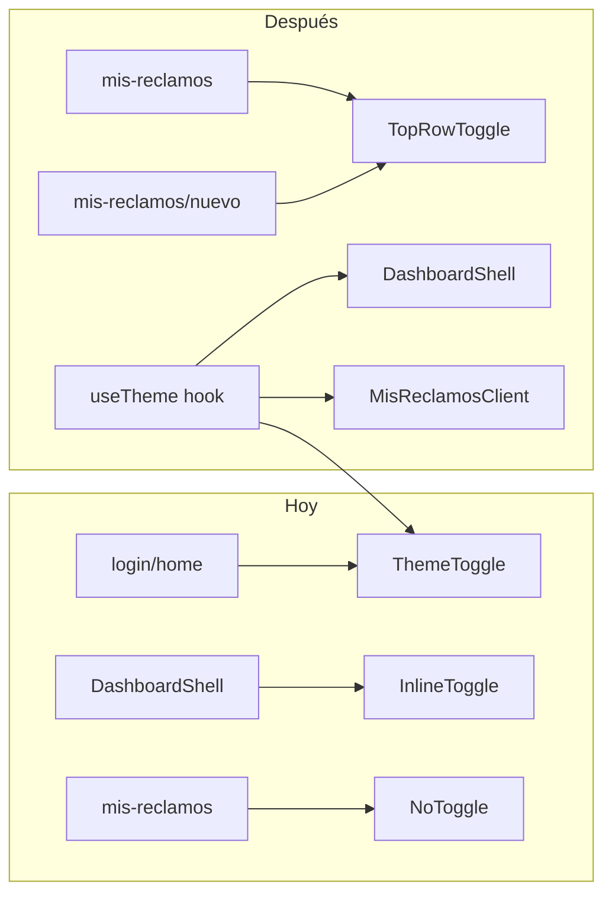

# Toggle dark/light para perfil ejecutor

## Contexto actual

- El tema ya funciona en login/home ([`src/components/ThemeToggle.tsx`](src/components/ThemeToggle.tsx)) y en el dashboard admin ([`src/app/(frontend)/dashboard/DashboardShell.tsx`](<src/app/(frontend)/dashboard/DashboardShell.tsx>)).
- Los usuarios `ejecutor` son redirigidos a `/mis-reclamos` y **no pasan por** `DashboardShell`, por eso hoy no tienen toggle.
- Persistencia: `localStorage['cav-theme']` + `data-theme="dark"` en `<html>`.
- Variables CSS en [`src/app/(frontend)/styles.css`](<src/app/(frontend)/styles.css>) (`:root` / `[data-theme='dark']`) ya cubren la mayoría de la UI de mis-reclamos (cards, drawer, textos). El header del ejecutor usa colores fijos blancos sobre `--c-header-strip` (verde oscuro en ambos modos), lo cual es coherente con el sidebar del dashboard.



## Implementación

### 1. Extraer lógica de tema compartida

Crear [`src/hooks/useTheme.ts`](src/hooks/useTheme.ts) con:

- Estado `theme: 'light' | 'dark'`
- `toggleTheme()` que lee/escribe `cav-theme` y aplica/remueve `data-theme` en `document.documentElement`
- `useEffect` de hidratación (mismo comportamiento que hoy)

Refactorizar para usar el hook:

- [`src/components/ThemeToggle.tsx`](src/components/ThemeToggle.tsx) — mantener variante `fixed` (login/home)
- [`src/app/(frontend)/dashboard/DashboardShell.tsx`](<src/app/(frontend)/dashboard/DashboardShell.tsx>) — eliminar duplicación inline (~20 líneas)

### 2. Toggle en perfil ejecutor (ubicación elegida: fila del título)

En [`src/app/(frontend)/mis-reclamos/MisReclamosClient.tsx`](<src/app/(frontend)/mis-reclamos/MisReclamosClient.tsx>):

- Importar `useTheme` + iconos `IconSun` / `IconMoon`
- En `.mis-reclamos-toprow`, después del `<h1>`, agregar botón a la derecha:

```tsx
<div className="mis-reclamos-toprow">
  {/* back/logout */}
  <h1 className="mis-reclamos-title">Mis Tareas</h1>
  <button className="mis-reclamos-theme-btn" onClick={toggleTheme} ...>
    {theme === 'dark' ? <IconSun /> : <IconMoon />}
  </button>
</div>
```

- Incluir el mismo botón en estados de loading/error para consistencia (opcional pero recomendado en error screen).

### 3. Toggle en `/mis-reclamos/nuevo`

En [`src/app/(frontend)/mis-reclamos/nuevo/page.tsx`](<src/app/(frontend)/mis-reclamos/nuevo/page.tsx>):

- Crear un wrapper client liviano (ej. `EjecutorNuevoShell.tsx`) que renderice `ThemeToggle` inline o reutilice el mismo botón, ya que `NuevoReclamoForm` es compartido con dashboard y no conviene modificar su layout interno.
- Alternativa mínima: `ThemeToggle` con prop `variant="inline"` y `className="mis-reclamos-theme-btn"` posicionado en un mini-header sobre el form (back implícito en el form + toggle a la derecha).

### 4. Estilos mobile-first

En [`src/app/(frontend)/styles.css`](<src/app/(frontend)/styles.css>), agregar `.mis-reclamos-theme-btn`:

- Basado en `.mis-reclamos-back-btn` / `.mis-reclamos-icon-btn` (38–42px, `border-radius: 10px`, área táctil cómoda)
- `flex-shrink: 0`, alineado al final de `.mis-reclamos-toprow`
- Colores con `rgba(255,255,255,...)` para el header verde oscuro (igual que back btn)
- Sin media queries obligatorias: el layout actual ya es columna full-width mobile-first; en pantallas anchas el botón queda en la misma fila sin cambios

Extender [`src/components/ThemeToggle.tsx`](src/components/ThemeToggle.tsx) con props opcionales:

```ts
type Props = {
  variant?: 'fixed' | 'inline'
  className?: string
}
```

### 5. Evitar flash de tema (FOUC)

Agregar script inline en [`src/app/(frontend)/layout.tsx`](<src/app/(frontend)/layout.tsx>) antes del render (patrón estándar Next.js):

```html
<script dangerouslySetInnerHTML={{ __html: `
  try {
    if (localStorage.getItem('cav-theme') === 'dark')
      document.documentElement.setAttribute('data-theme','dark');
  } catch(e) {}
`}} />
```

Así el tema se aplica antes de hidratar React en todas las rutas, incluido ejecutor.

### 6. Verificación visual (light + dark)

Probar manualmente en mobile (~375px) y desktop:

| Vista                 | Qué revisar                                                                      |
| --------------------- | -------------------------------------------------------------------------------- |
| `/mis-reclamos`       | Header, búsqueda, cards, drawer de resolución, badges de estado                  |
| `/mis-reclamos/nuevo` | Formulario, inputs, mapa, botones                                                |
| Persistencia          | Cambiar tema → recargar → debe mantenerse                                        |
| Cross-route           | Tema en mis-reclamos debe coincidir si el usuario vino del login con dark activo |

Si algún elemento queda con bajo contraste en modo claro (poco probable en cards porque usan `--c-*`), ajustar solo ese selector puntual en `styles.css`.

## Archivos a tocar

| Archivo                                                 | Cambio                        |
| ------------------------------------------------------- | ----------------------------- |
| `src/hooks/useTheme.ts`                                 | **Nuevo** — lógica compartida |
| `src/components/ThemeToggle.tsx`                        | Usar hook + variant `inline`  |
| `src/app/(frontend)/mis-reclamos/MisReclamosClient.tsx` | Botón en top row              |
| `src/app/(frontend)/mis-reclamos/nuevo/`                | Wrapper client con toggle     |
| `src/app/(frontend)/dashboard/DashboardShell.tsx`       | Usar hook (cleanup)           |
| `src/app/(frontend)/layout.tsx`                         | Script anti-FOUC              |
| `src/app/(frontend)/styles.css`                         | `.mis-reclamos-theme-btn`     |

## Fuera de alcance

- Cambiar el color del header strip a claro en modo light (hoy es verde oscuro por diseño, igual que sidebar del dashboard).
- Mapa de reclamos para ejecutor (otro ítem en `.anotaciones.md`).
